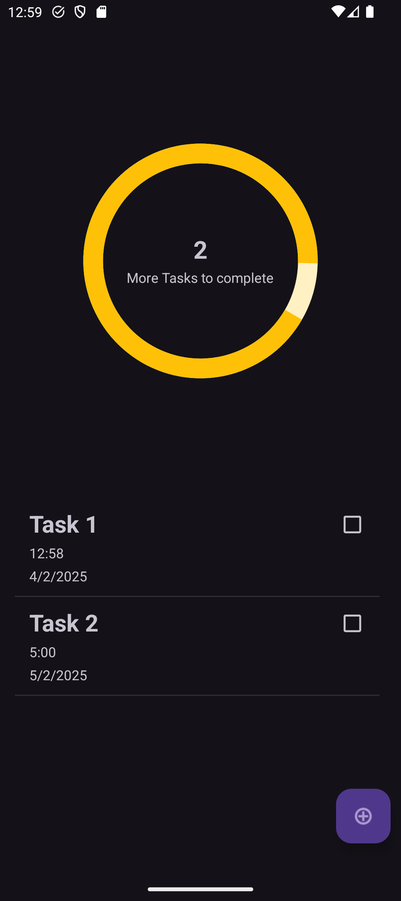
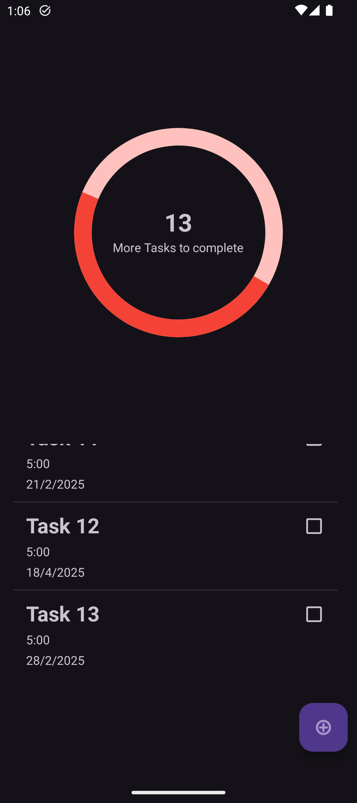
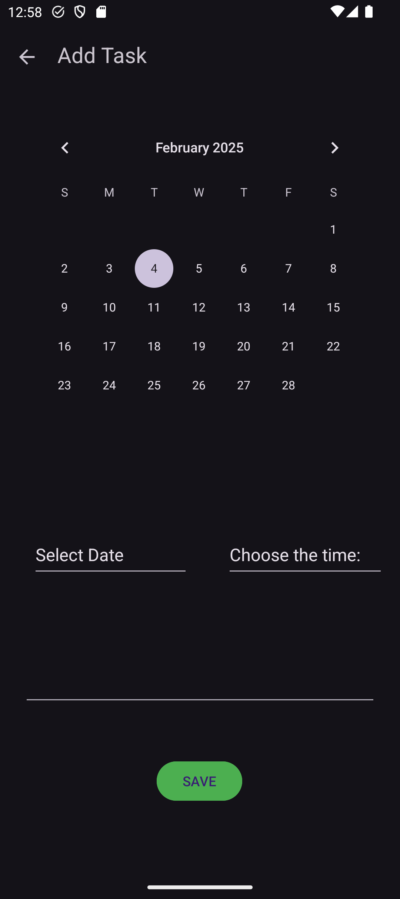
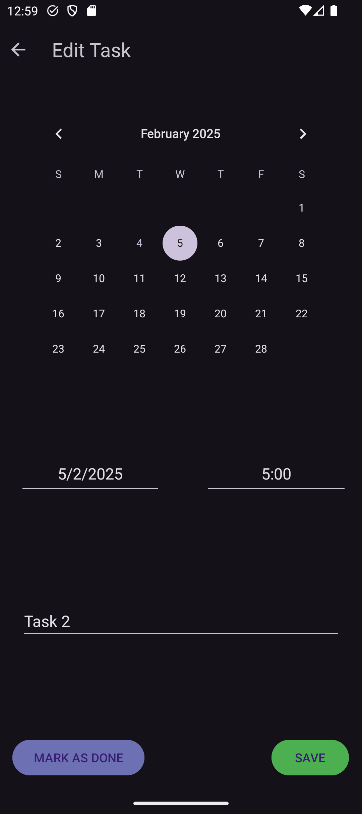
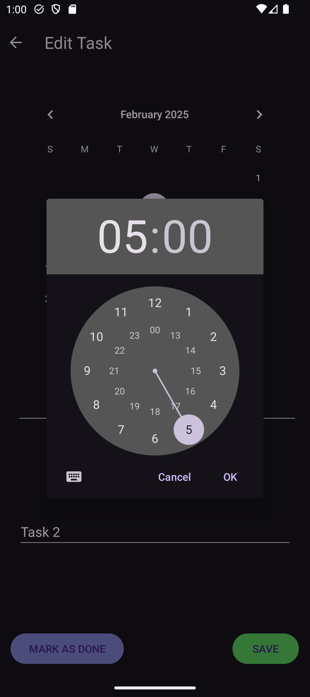

# TaskMate App  

It is a simple task management application built with Android Studio and Java. It allows users to create, edit, and delete tasks while receiving reminders at the correct time and date. It also consists of a progress circle to track task completion visually.

## Features  
✔️ Add, edit, and delete tasks

✔️ Set reminders for tasks

✔️ Track task completion.

✔️ Notifications for due tasks  


## Screenshots  

|  |  |  |
| ---------------------------------------------- | -------------------------------------------- | ------------------------------------------- |
|  |  |  |

## Installation  
1. Clone the repository:  
   ```sh
   git clone https://github.com/Deeshan-Liyanage27/Task_App
   ```
2. Open the project in **Android Studio**.  
3. Build and run the app on an emulator or a physical device.  

## Requirements  
- Android Studio  
- Android Version 12+
- Java

## Usage  
1. Launch the app.  
2. Click the **Add Task** button.  
3. Enter task details and press **Save**.
   
If needed;
   -	Click on the Task to edit it.
   -	Click the box next to the task to mark as done.
